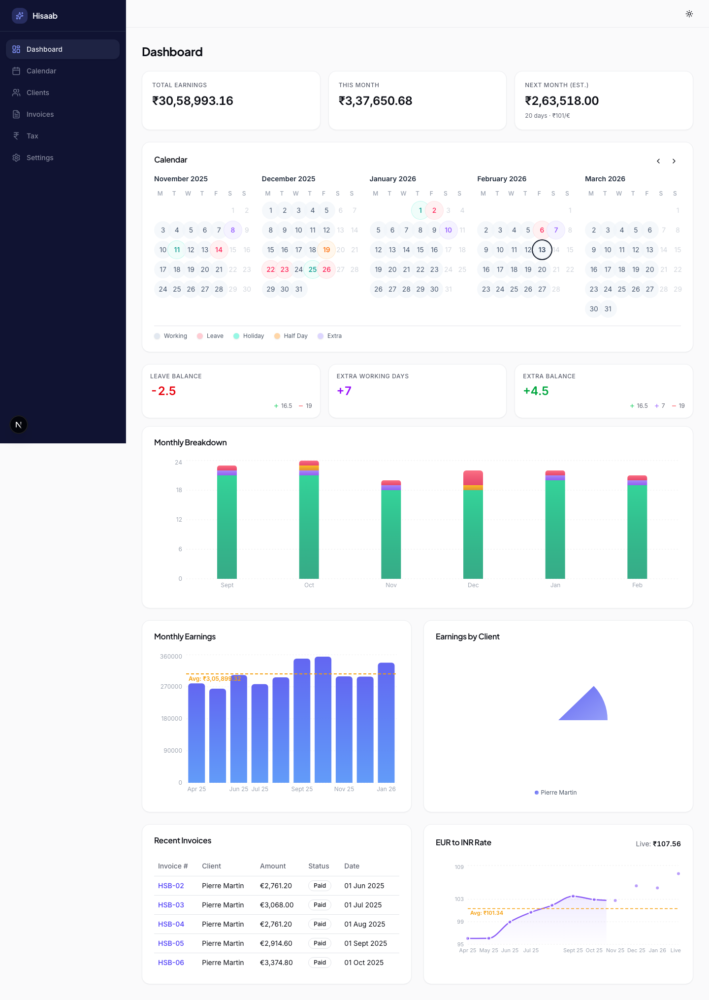
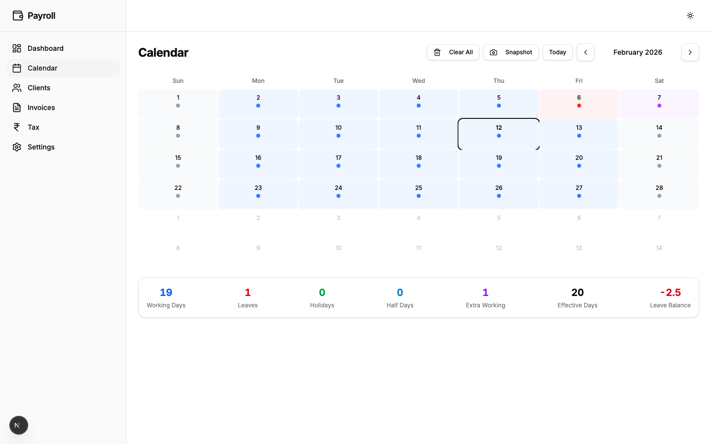
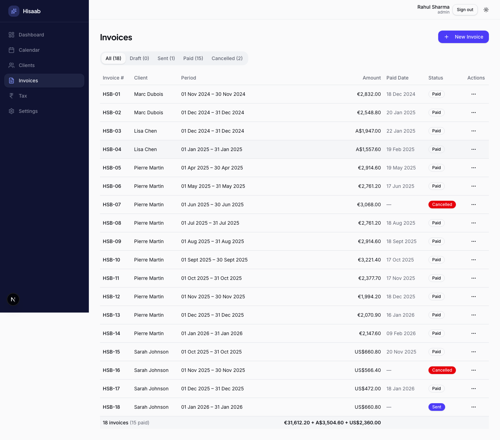
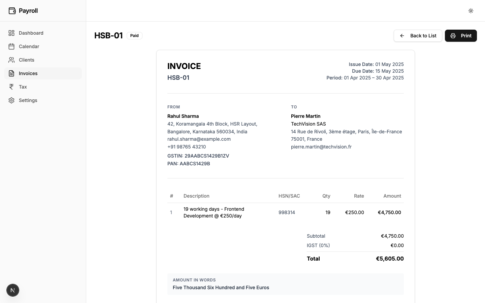
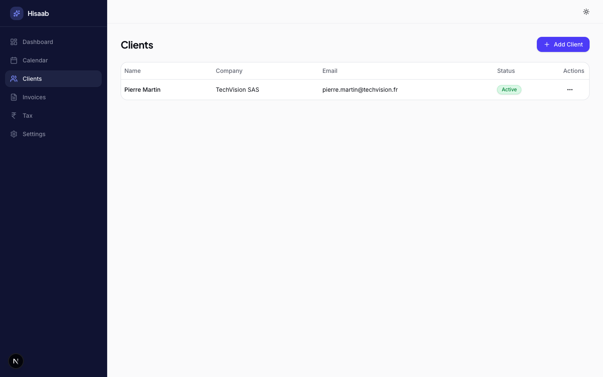
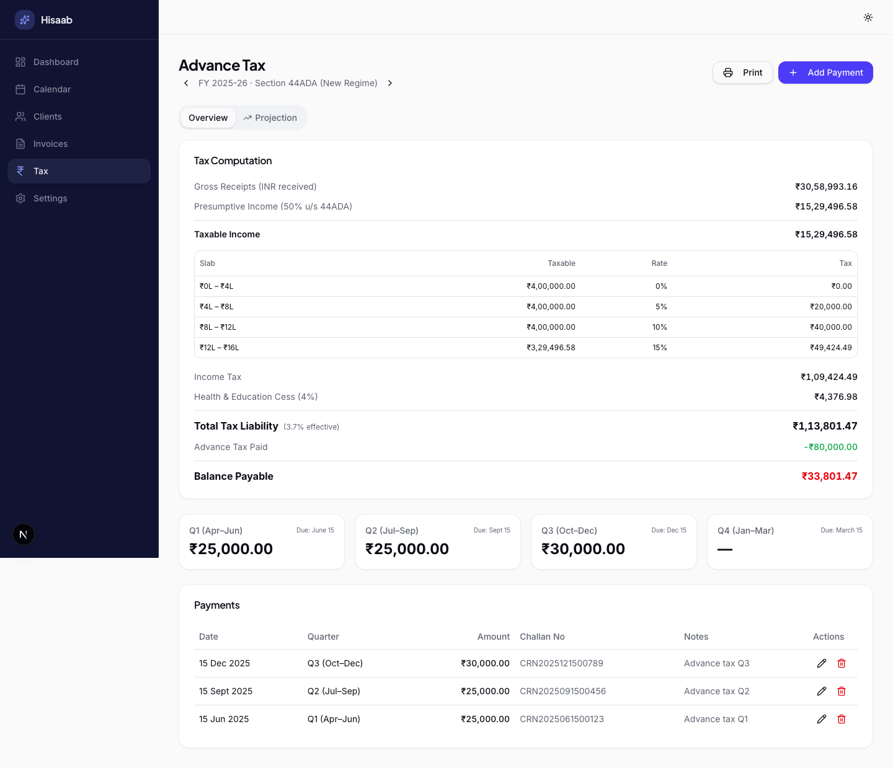
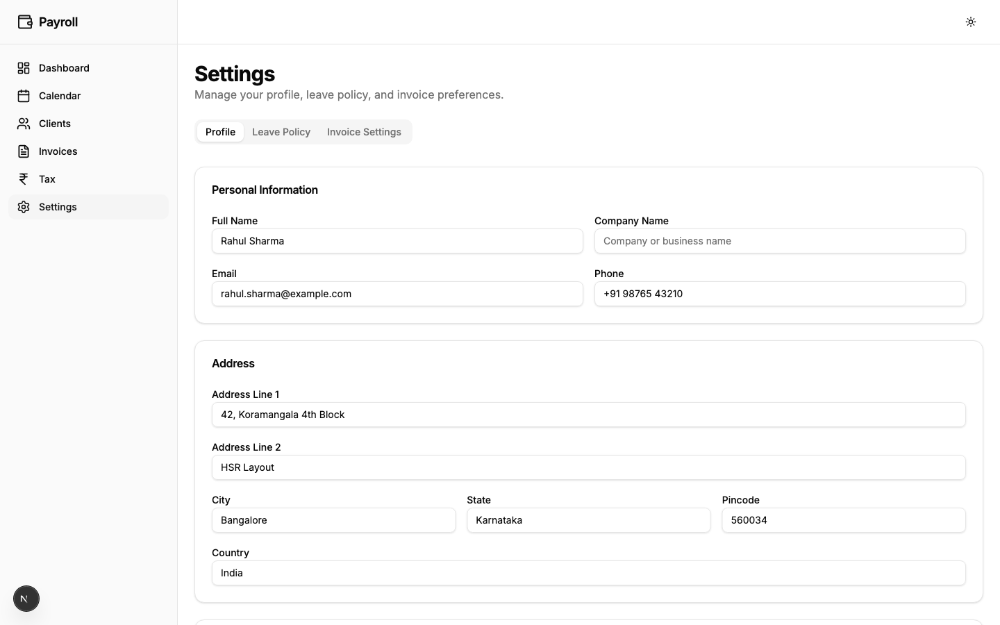

# Hisaab

A freelancer payroll management app for tracking income, clients, invoices, work days, and tax obligations. Built with Next.js, SQLite, and Drizzle ORM.

## Features

- **Dashboard** — Overview of earnings, invoices, leave balance, and financial projections
- **Client Management** — Create and manage client profiles with projects and daily rates
- **Calendar** — Track working days, leaves, holidays, half-days, and extra working days
- **Invoices** — Generate invoices with line items, tax calculations (CGST/SGST/IGST), and PDF export
- **Payments** — Record payment receipts with EUR-to-INR exchange rates and bank/platform charges
- **Tax Tracking** — Track quarterly advance tax payments by financial year
- **Settings** — Configure invoice numbering, tax rates, leave policies, and user profile

## Screenshots

### Dashboard


### Calendar


### Invoices


### Invoice Detail


### Client Management


### Tax Tracking


### Settings


## Tech Stack

- **Framework:** Next.js 16 (App Router, Server Actions, Turbopack)
- **Language:** TypeScript
- **Database:** SQLite with Drizzle ORM
- **UI:** Tailwind CSS, Shadcn/ui, Radix UI
- **Charts:** Recharts

## Prerequisites

- Node.js 18+
- npm

## Setup

1. **Install dependencies**

   ```bash
   npm install
   ```

2. **Initialize the database**

   ```bash
   npm run db:push
   ```

   This creates the SQLite database at `data/payroll.db`.

3. **Start the dev server**

   ```bash
   npm run dev
   ```

4. Open [http://localhost:3000/hisaab](http://localhost:3000/hisaab)

## Production Build

```bash
npm run build
npm start
```
