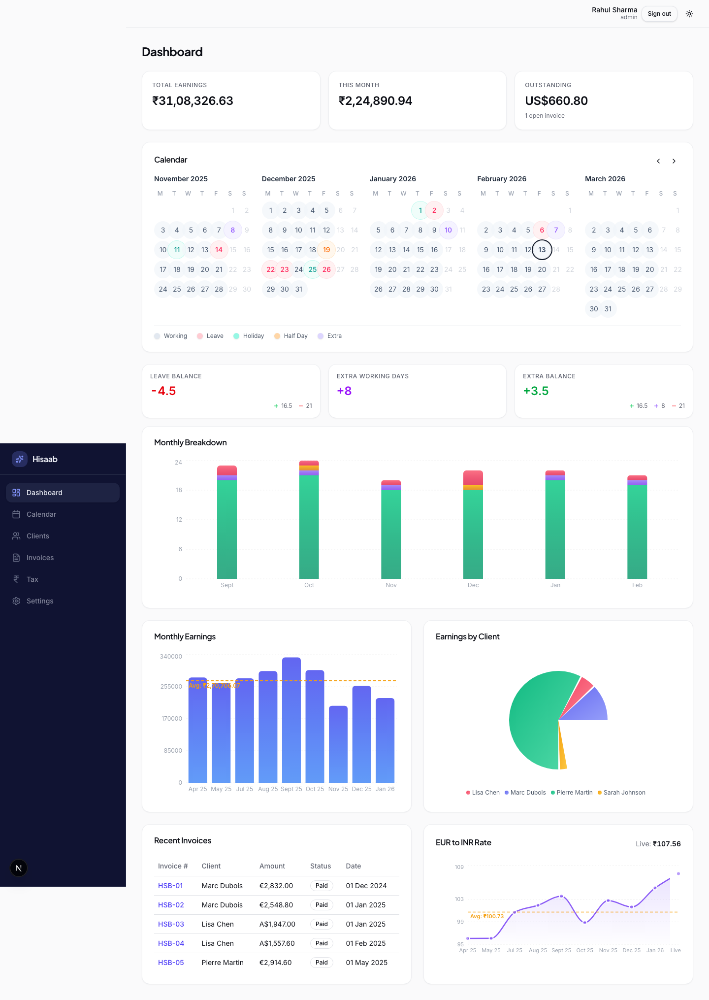
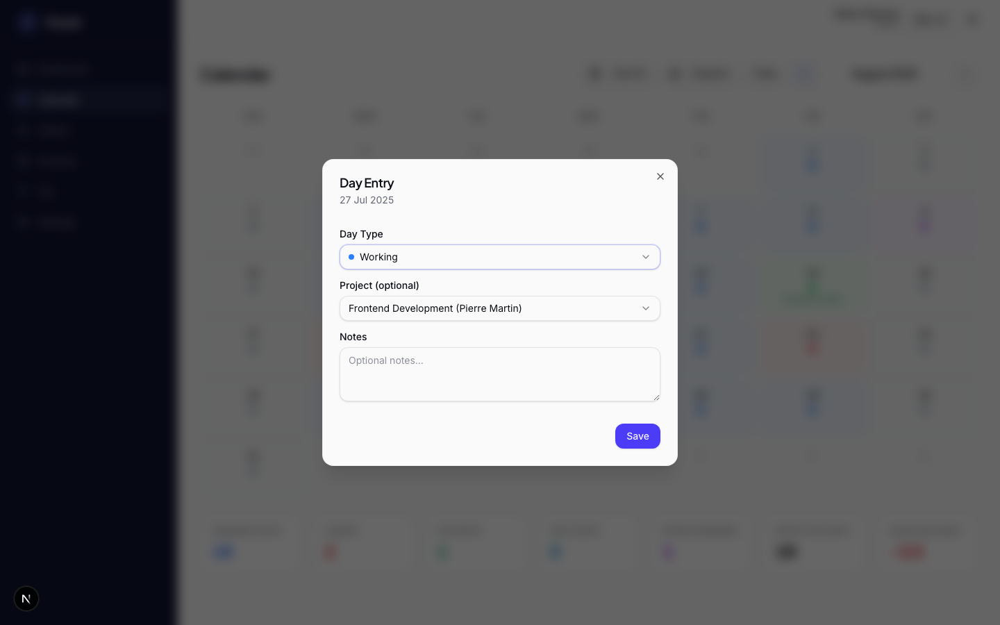
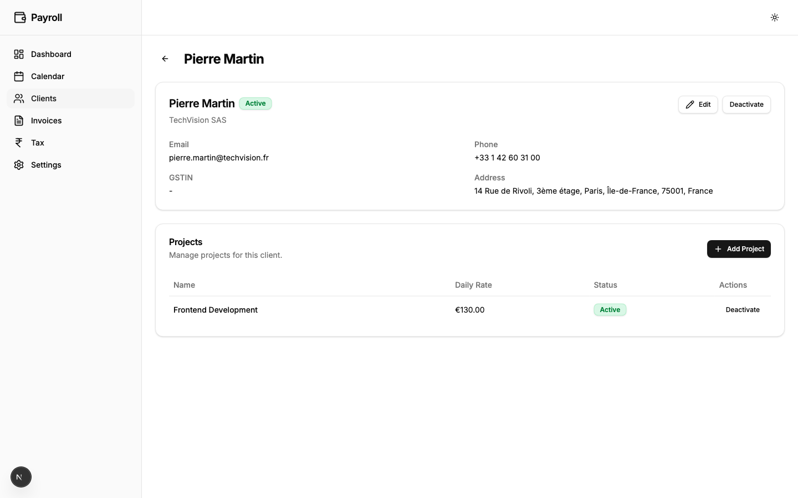
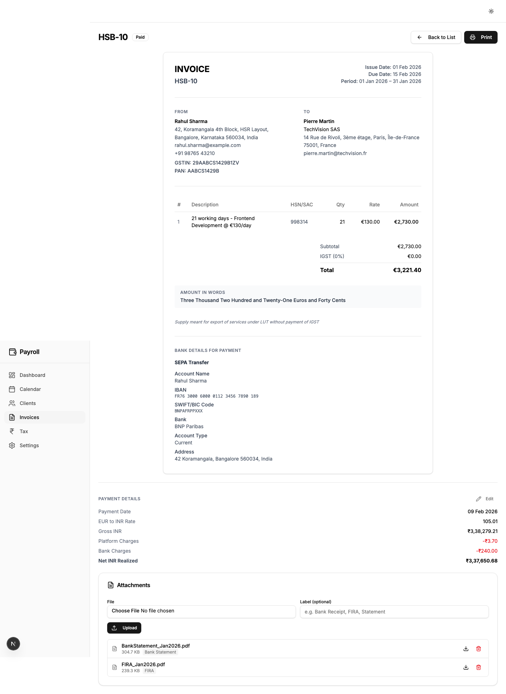
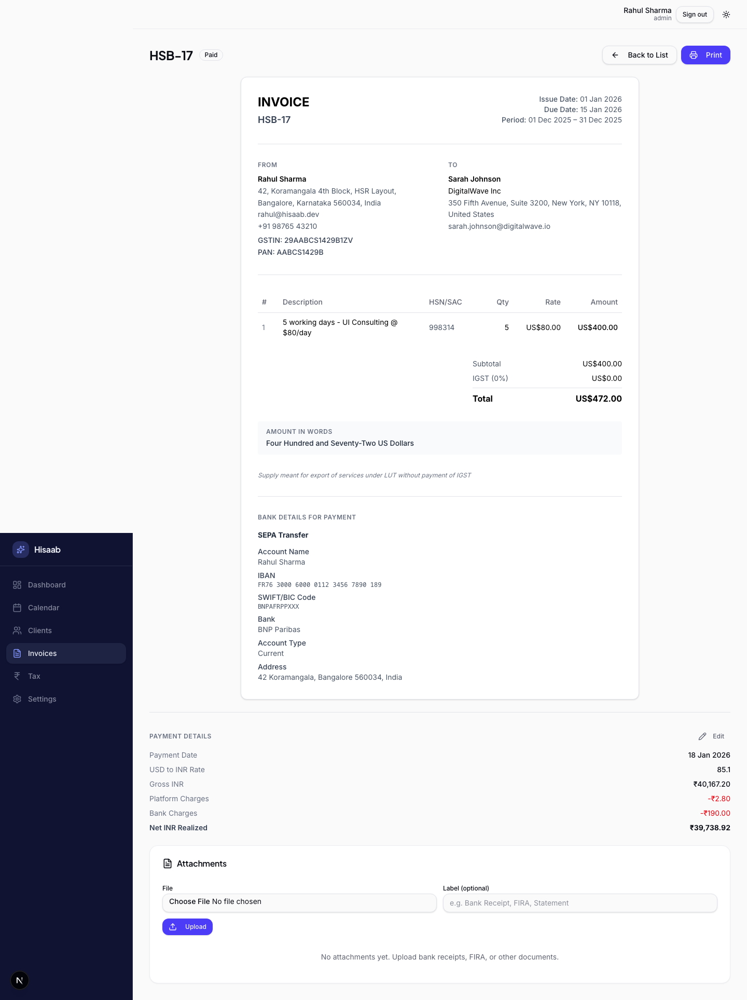
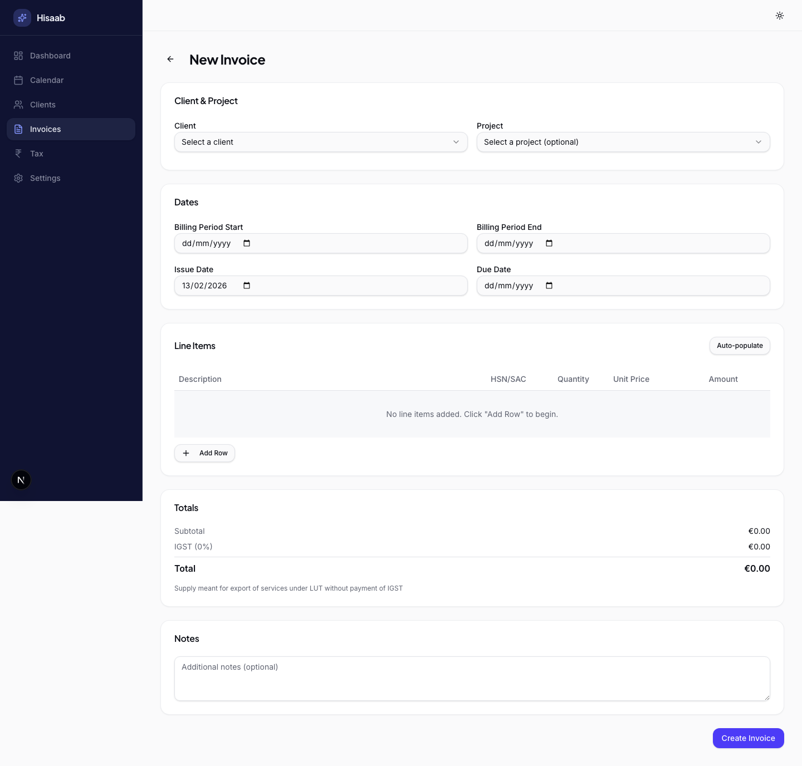
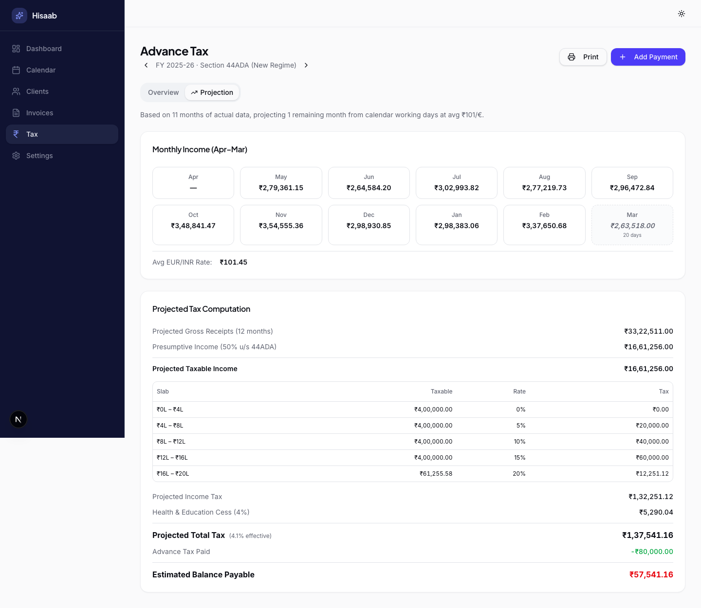
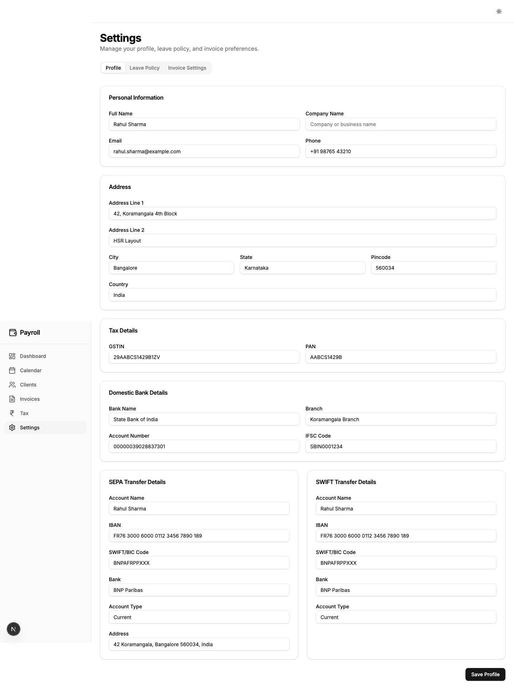
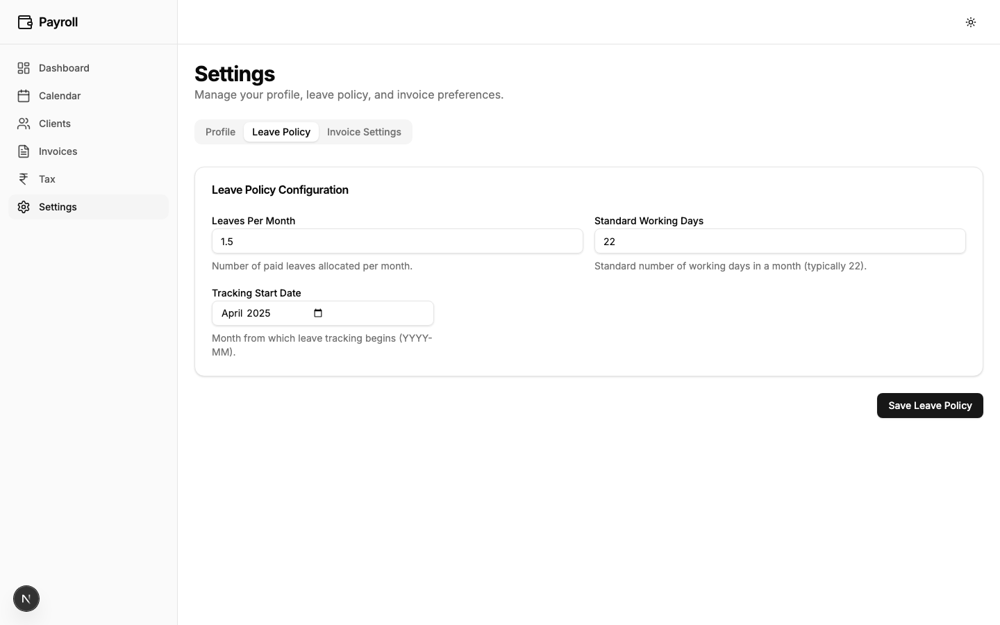
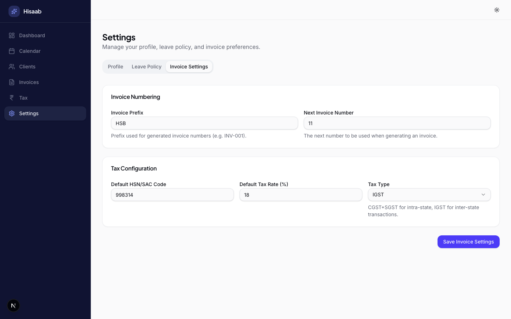

# Hisaab

A freelancer payroll management app for tracking income, clients, work days, invoices, payments, attachments, and tax obligations.

## Features

- Dashboard - Earnings, balances, recent invoices, and live exchange-rate trends
- Client & Project Management - Per-client projects, status toggles, and currency-aware daily rates
- Calendar & Day Entries - Working days, leaves, holidays, and per-day notes/project mapping
- Invoice Creation - Auto-populate line items from calendar entries with LUT export note
- Invoice Detail & Export - Printable invoice view with tax summary and SEPA/SWIFT payment snapshots
- Payment Reconciliation - Paid date, FX conversion, platform/bank charges, and net INR realized
- Invoice Attachments - Upload and manage proof documents like FIRA and bank statements after payment
- Tax Tracking - Advance-tax computation, quarterly payments, and projection tab
- Settings - Profile, domestic bank details, SEPA/SWIFT transfer details, leave policy, and invoice settings

## Screenshots

### Dashboard


### Dashboard Charts


### Calendar


### Calendar Day Entry


### Client Management


### Client Detail


### Invoices


### Invoice Detail


### Invoice Payment Details


### Invoice Attachments (FIRA / Bank Statement)


### Invoice Create Form


### Tax Overview


### Tax Projection


### Settings Overview


### Settings - Bank Details


### Settings - Leave Policy


### Settings - Invoice Settings


## Demo Flow

Use `docs/DEMO_SCRIPT.md` as the walkthrough checklist for demos and screenshot capture order.

## Documentation Automation

- Regenerate screenshots, sync README, and run checks:
  ```bash
  npm run docs:refresh
  ```
- Only regenerate screenshots:
  ```bash
  npm run docs:screenshots
  ```
- Only sync and validate README:
  ```bash
  npm run docs:readme
  ```

## Tech Stack

- Framework: Next.js 16 (App Router, Server Actions, Turbopack)
- Language: TypeScript
- Database: SQLite with Drizzle ORM
- UI: Tailwind CSS, shadcn/ui, Radix UI
- Charts: Recharts
- Automation: Playwright

## Setup

1. Install dependencies:
   ```bash
   npm install
   ```
2. Initialize the database:
   ```bash
   npm run db:push
   ```
3. Start the app:
   ```bash
   npm run dev
   ```
4. Open `http://localhost:3000/hisaab`.

## Production Build

```bash
npm run build
npm start
```
