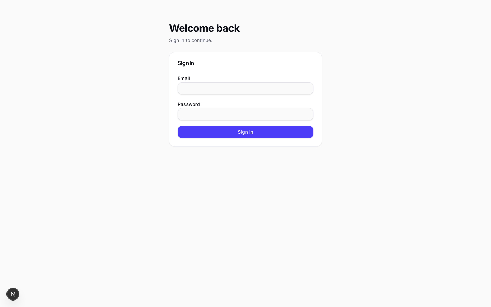
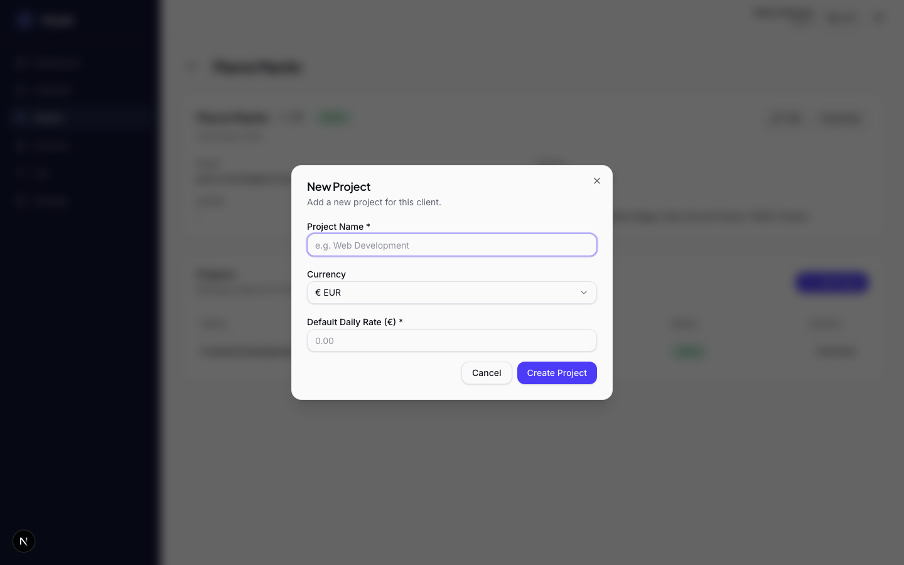
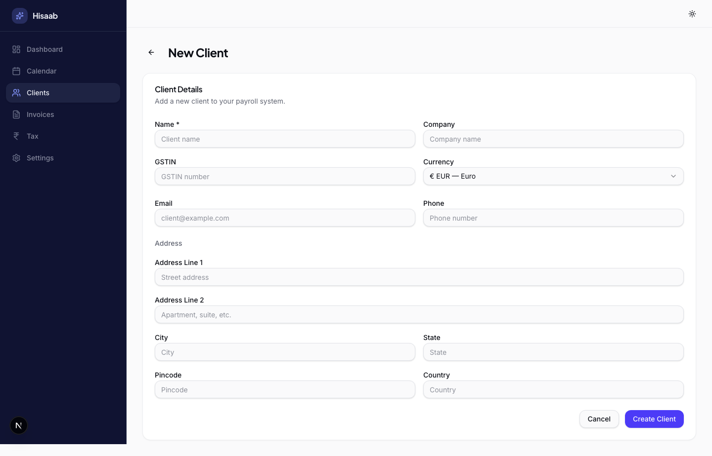
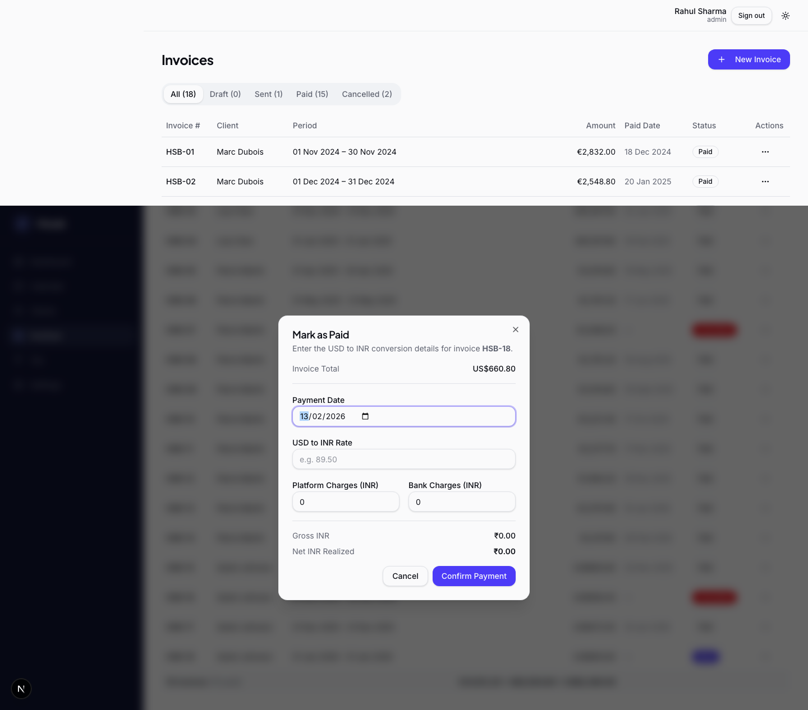
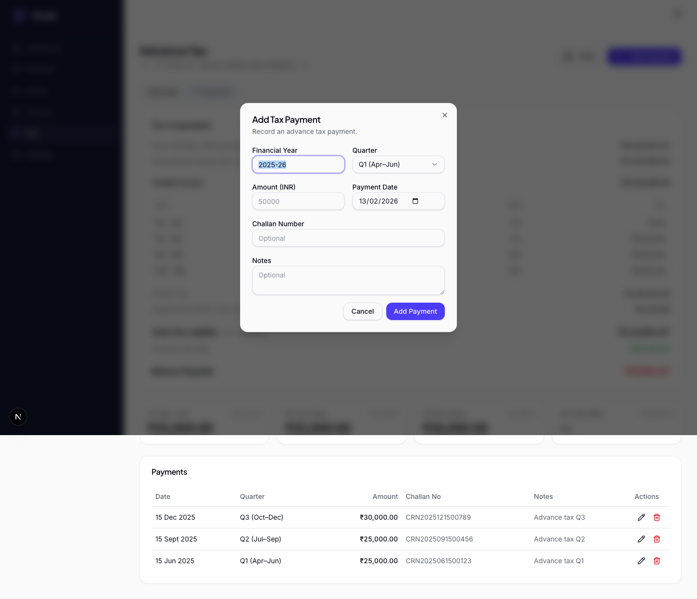

# Hisaab

A freelancer payroll management app for tracking income, clients, work days, invoices, payments, attachments, and tax obligations.

## Features

- Dashboard - Earnings, balances, recent invoices, and live exchange-rate trends
- Client & Project Management - Per-client projects, status toggles, and currency-aware daily rates
- Calendar & Day Entries - Working days, leaves, holidays, and per-day notes/project mapping
- Invoice Creation - Auto-populate line items from calendar entries with LUT export note
- Invoice Detail & Export - Printable invoice view with tax summary and SEPA/SWIFT payment snapshots
- Payment Reconciliation - Paid date, FX conversion, platform/bank charges, and net INR realized
- Invoice Attachments - Upload and manage proof documents like FIRA and bank statements after payment
- Tax Tracking - Advance-tax computation, quarterly payments, and projection tab
- Settings - Profile, domestic bank details, SEPA/SWIFT transfer details, leave policy, and invoice settings
- Access Control - Admin setup, viewer accounts with tags, and session-based authentication

## Screenshots

### Login
Your data stays yours. One-click sign-in keeps freelancers in and strangers out.



### Dashboard
Everything you earned this year, last month, and today — in one glance. No spreadsheet gymnastics required.


### Dashboard Charts
Watch your income trend upward and exchange rates in real time. The graphs your accountant wishes you had.


### Calendar
Color-coded work days, leaves, holidays, and overtime — your entire month mapped out like a visual timesheet.


### Calendar Day Entry
Click any day to log work, mark leave, or add notes. Time tracking that takes 2 seconds, not 20 minutes.


### Calendar Snapshot
One-click monthly summary: working days, leaves, overtime, and balance. Perfect for client reports.


### Client Management
All your clients at a glance — active, inactive, multi-currency. Manage a global roster from one place.


### Client Detail
Deep-dive into any client: projects, rates, invoices, and contact info. Everything your next invoice needs.


### Add Project
Spin up a new project with a daily rate in seconds. Because freelancers juggle more than one gig at a time.



### New Client Form
Onboard a client in under a minute — name, company, address, currency. Ready to invoice on day one.



### Invoices
Paid, sent, cancelled — every invoice across every client, filterable and sorted. Never chase a payment blind.


### Mark as Paid
Record FX rate, platform fees, and bank charges when marking paid. Know exactly how much hit your account.



### Invoice Detail
A print-ready invoice with line items, tax breakdown, and SEPA/SWIFT payment details baked in.


### Invoice Payment Details
FX conversion, platform charges, bank fees — see the full money trail from client payment to your bank.


### Invoice Attachments
Attach FIRA certificates, bank statements, or any proof doc right on the invoice. Audit-ready in one click.


### Invoice Create Form
Auto-populated from your calendar — just pick the month and client. Your invoice writes itself.


### Tax Overview
Advance tax paid, quarterly breakdown, and remaining liability. File day stops being a surprise.


### Tax Projection
See what you'll owe before the quarter ends. Plan ahead so tax season is a non-event.


### Tax Payment
Log each challan with amount, date, and reference number. Your tax paper trail, digitized.



### Settings
Your profile, GSTIN, PAN, and domestic bank details — the foundation every invoice is built on.


### Settings - Leave Policy
Set leaves per month and tracking start date. The app does the math — you just take the day off.


### Settings - Invoice Settings
Invoice prefix, auto-numbering, default HSN/SAC, and tax type. Configure once, invoice forever.


### Settings - Access Control
Add your accountant, CA, or lawyer as read-only viewers with tags. Share access without sharing your password.


## Demo Flow

Use `docs/DEMO_SCRIPT.md` as the walkthrough checklist for demos and screenshot capture order.

## Documentation Automation

- Regenerate screenshots, sync README, and run checks:
  ```bash
  npm run docs:refresh
  ```
- Only regenerate screenshots:
  ```bash
  npm run docs:screenshots
  ```
- Only sync and validate README:
  ```bash
  npm run docs:readme
  ```

## Tech Stack

- Framework: Next.js 16 (App Router, Server Actions, Turbopack)
- Language: TypeScript
- Database: SQLite with Drizzle ORM
- UI: Tailwind CSS, shadcn/ui, Radix UI
- Charts: Recharts
- Automation: Playwright

## Setup

1. Install dependencies:
   ```bash
   npm install
   ```
2. Initialize the database:
   ```bash
   npm run db:push
   ```
3. Start the app:
   ```bash
   npm run dev
   ```
4. Open `http://localhost:3000/hisaab`.

## Production Build

```bash
npm run build
npm start
```

## Self-Hosting with Docker

Host Hisaab on your home server (tested on Beelink Mini S13) so it runs 24/7 and is accessible to your accountant, CA, or anyone on your network.

### Prerequisites

- [Docker](https://docs.docker.com/engine/install/) and [Docker Compose](https://docs.docker.com/compose/install/) installed on your server
- Git (to clone the repo)

### Quick Start

```bash
# Clone the repo
git clone https://github.com/your-username/hisaab.git
cd hisaab

# Build and start (runs in background, restarts automatically)
docker compose up -d --build
```

Hisaab is now running at **http://your-server-ip:3000**

### Configuration

Create a `.env` file to customize settings (all optional):

```env
# Port to expose on the host (default: 3000)
PORT=3000

# Where to store database and attachments on the host (default: ./data)
DATA_LOCATION=./data
```

### Commands Reference

```bash
# Start the app (build + run in background)
docker compose up -d --build

# View logs
docker compose logs -f

# Stop the app
docker compose down

# Restart the app
docker compose restart

# Rebuild after pulling new changes
git pull
docker compose up -d --build

# Check health status
docker inspect --format='{{.State.Health.Status}}' hisaab

# Back up your data (database + attachments)
cp -r ./data ./data-backup-$(date +%Y%m%d)
```

### Data & Backups

All your data lives in one directory (`./data` by default):
- `payroll.db` — SQLite database (clients, invoices, settings, etc.)
- `attachments/` — uploaded invoice attachments

To back up, just copy this directory. To migrate to a new server, copy `./data` to the new machine and run `docker compose up -d --build`.

### Accessing from Other Devices

Once running, Hisaab is accessible to anyone on your local network at `http://<server-ip>:3000`.

To share with people outside your network (your CA, accountant, etc.), you have a few options:

1. **Tailscale / ZeroTier** (recommended) — Create a private network. Install the client on your server and their devices. No port forwarding needed, fully encrypted.
2. **Cloudflare Tunnel** — Expose your server to the internet securely without opening ports. Free tier available.
3. **Reverse proxy + port forwarding** — Use Nginx or Caddy as a reverse proxy with a domain name and Let's Encrypt SSL. Forward port 443 on your router to the server.

### Updating

```bash
cd hisaab
git pull
docker compose up -d --build
```

The database schema auto-migrates on startup, so updates are safe.

### Automated Updates (Cron)

Use the built-in script to auto-update the server when `main` changes:

```bash
cd hisaab
chmod +x scripts/auto-update.sh scripts/install-auto-update-cron.sh
bash scripts/install-auto-update-cron.sh
```

Default schedule is every 10 minutes and logs go to `./data/auto-update.log`.

Customize schedule or log file:

```bash
INTERVAL="*/5 * * * *" LOG_FILE="$HOME/hisaab-update.log" bash scripts/install-auto-update-cron.sh
```

The updater script:
- fetches `origin/main`
- skips if no commit changed
- fast-forward pulls when new commits exist
- runs `docker compose up -d --build --remove-orphans`
- skips deployment if local uncommitted changes exist

Remove the cron job:

```bash
crontab -l | grep -v 'hisaab-auto-update' | crontab -
```
